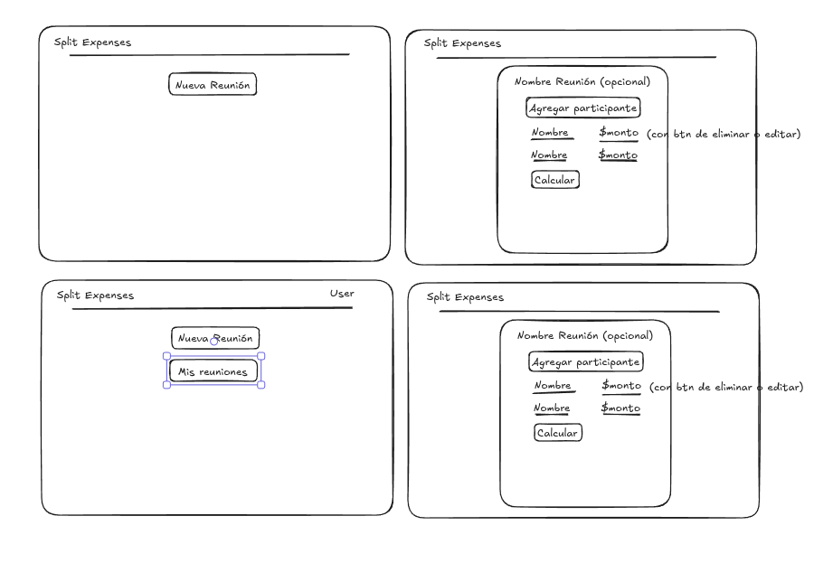

# Split Expenses

Split Expenses es una aplicación web diseñada para simplificar el reparto de gastos entre varias personas. Su objetivo es calcular automáticamente cuánto debe aportar cada participante y minimizar la cantidad de transferencias necesarias para saldar las deudas.

Además de resolver un problema cotidiano, este proyecto tiene como objetivo servir como base para aplicar buenas prácticas de desarrollo, arquitectura de software, testing y herramientas utilizadas en entornos profesionales.

---

# Visión

## Objetivos

- Facilitar el cálculo y reparto de gastos compartidos entre varias personas.
- Minimizar la cantidad de transferencias entre participantes.
- Ofrecer una experiencia simple para usuarios no registrados.
- Permitir guardar reuniones para usuarios autenticados.

## No objetivos

Esta aplicación **no busca**:

- Procesar pagos.
- Enviar dinero entre usuarios.
- Funcionar como una billetera virtual.
- Administrar presupuestos personales.
- Tener chat entre participantes.
- Reemplazar aplicaciones de contabilidad.

## Público objetivo

- Grupos de amigos.
- Compañeros de trabajo.
- Viajes.
- Cumpleaños.
- Asados.
- Vacaciones.

---

# Funcionalidades

## Uso sin iniciar sesión (MVP)

- Crear una reunión.
- Agregar participantes.
- Registrar el monto pagado por cada participante.
- Calcular automáticamente cuánto debe aportar cada persona.
- Mostrar un resumen final.

## Usuarios autenticados

- Guardar reuniones.
- Consultar historial.
- Ver estadísticas de gastos.

---

# Requisitos

## Requisitos funcionales (MVP)

La aplicación debe permitir:

- Crear una reunión.
- Agregar participantes.
- Registrar cuánto pagó cada participante.
- Calcular automáticamente quién debe dinero a quién.
- Mostrar el resumen final.

## Requisitos no funcionales

La aplicación deberá:

- Mantener una arquitectura modular y escalable.
- Utilizar TypeScript tanto en frontend como en backend.
- Validar toda la información ingresada por el usuario.
- Implementar autenticación segura mediante cookies HttpOnly.
- Mantener un código limpio, tipado y documentado.
- Ser responsive.
- Contar con pruebas automatizadas para las funcionalidades críticas.

## Funcionalidades futuras

- Registro de usuarios.
- Login con Google (OAuth).
- Historial de reuniones.
- Compartir resultados.

---

# Flujo del usuario

## Usuario sin iniciar sesión

```text
Inicio
   │
   ▼
Nueva reunión
   │
   ▼
Agregar participantes
   │
   ▼
Registrar gastos
   │
   ▼
Calcular
   │
   ▼
Ver resumen
   │
   ▼
Fin
```

## Usuario autenticado

```text
Inicio
   │
   ▼
Login
   │
   ▼
Dashboard
   │
   ▼
Nueva reunión
   │
   ▼
Agregar participantes
   │
   ▼
Registrar gastos
   │
   ▼
Calcular
   │
   ▼
Ver resumen
   │
   ▼
Guardar reunión
   │
   ▼
Historial
```

---

# Wireframes



---

# Modelo de dominio

```text
Usuario
--------
- nombre
- email

   │ posee
   ▼

Reunión
--------
- nombre
- fecha

   │ contiene
   ▼

Participante
------------
- nombre
- montoPagado
```

---

# Arquitectura

## Arquitectura general

```text
React
   │
   ▼
REST API
   │
   ▼
Express
   │
   ▼
Services
   │
   ▼
Repositories
   │
   ▼
Drizzle ORM
   │
   ▼
PostgreSQL
```

## Arquitectura del backend

El backend seguirá una arquitectura en capas para separar responsabilidades y facilitar el mantenimiento.

```text
src/
│
├── routes/
├── controllers/
├── services/
├── repositories/
├── db/
├── middlewares/
├── schemas/
├── types/
├── utils/
├── config/
└── lib/
```

Flujo de una petición:

```text
Route
   │
   ▼
Controller
   │
   ▼
Service
   │
   ▼
Repository
   │
   ▼
Database
```

---

# Stack tecnológico

## Frontend

| Herramienta | Propósito |
|-------------|-----------|
| React 19 | Biblioteca principal |
| TypeScript | Tipado estático |
| Vite | Build Tool |
| React Router | Enrutamiento |
| TanStack Query | Estado del servidor |
| Zustand | Estado de la interfaz |
| React Hook Form | Manejo de formularios |
| Zod | Validación |
| Axios | Cliente HTTP |
| Tailwind CSS | Estilos |

## Backend

| Herramienta | Propósito |
|-------------|-----------|
| Express | Framework HTTP |
| TypeScript | Tipado |
| PostgreSQL | Base de datos |
| Drizzle ORM | ORM tipado |
| Zod | Validación |
| Argon2 | Hash de contraseñas |
| JWT | Autenticación |
| Cookies HttpOnly | Manejo seguro de sesiones |
| Google OAuth | Login social |
| Pino | Logging |
| Helmet | Seguridad HTTP |
| express-rate-limit | Protección contra abuso |
| CORS | Control de acceso |
| dotenv | Variables de entorno |

## Calidad

- ESLint
- Prettier
- Husky
- lint-staged
- Vitest
- React Testing Library
- Supertest
- Docker
- GitHub Actions

---

# Principios del proyecto

Durante el desarrollo se priorizarán los siguientes principios:

- Simplicidad antes que complejidad.
- Código limpio y mantenible.
- Responsabilidad única por componente.
- Seguridad por defecto.
- Arquitectura escalable.
- Documentación clara.
- Testing automatizado.
- Tipado estricto.
- Uso de herramientas consolidadas en la industria.

---

# Decisiones de arquitectura

Cálculo de gastos

La lógica de cálculo se implementará completamente en el frontend.

*Motivos*
- La aplicación debe funcionar sin autenticación.
- El cálculo no requiere acceso a la base de datos.
- El resultado puede obtenerse de forma inmediata.
- El backend queda enfocado en autenticación y persistencia.

**Backend**
- El backend actuará únicamente como servicio de autenticación y persistencia.
- No realizará cálculos relacionados con el reparto de gastos.

**Autenticación**
- Solo los usuarios autenticados podrán guardar reuniones y consultar el historial.